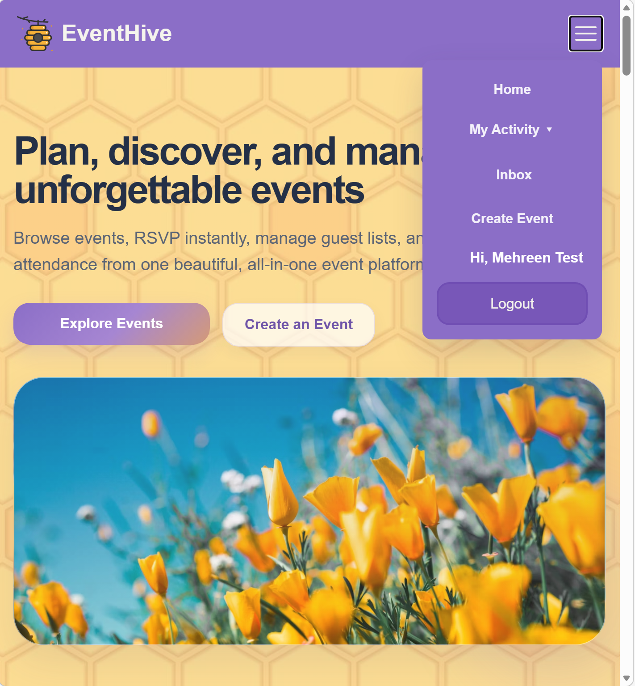
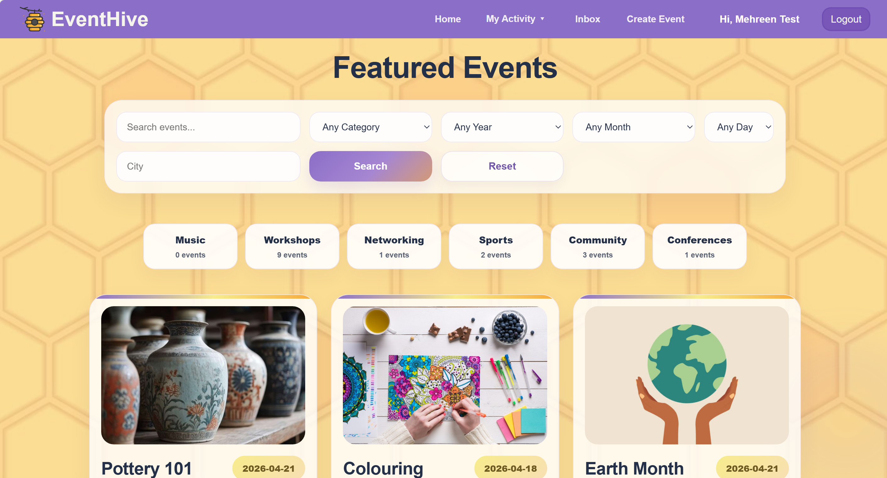
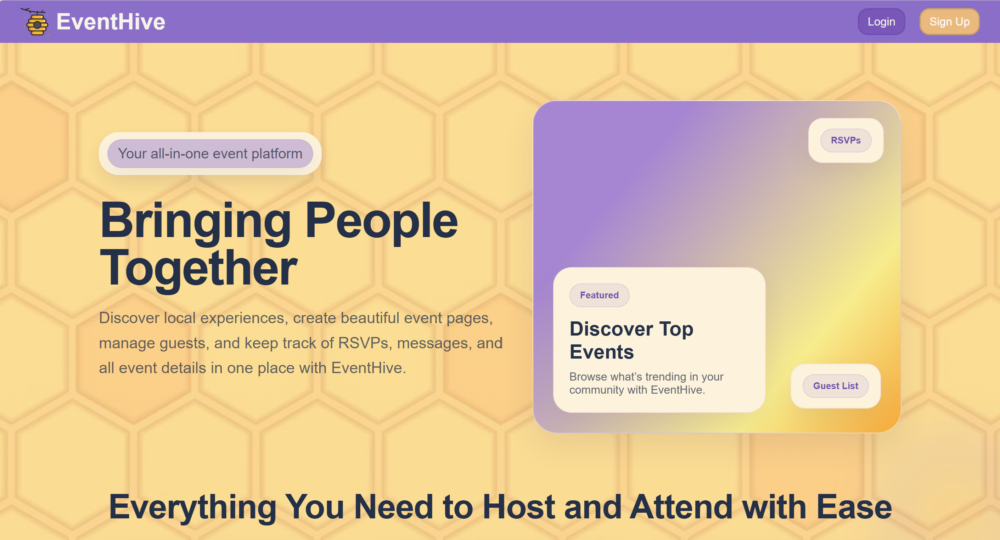
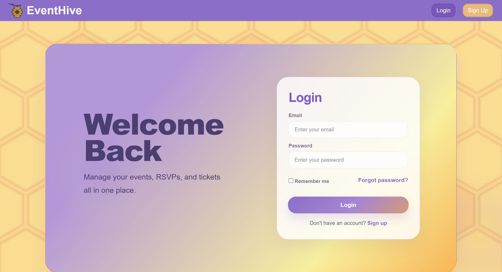
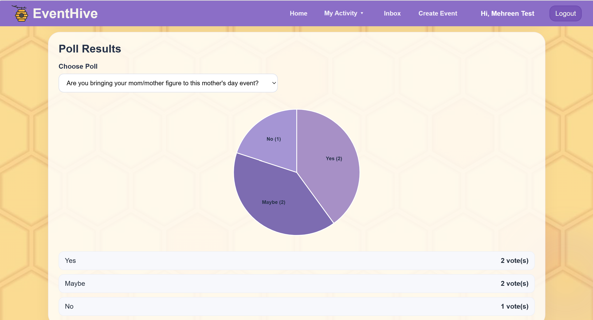
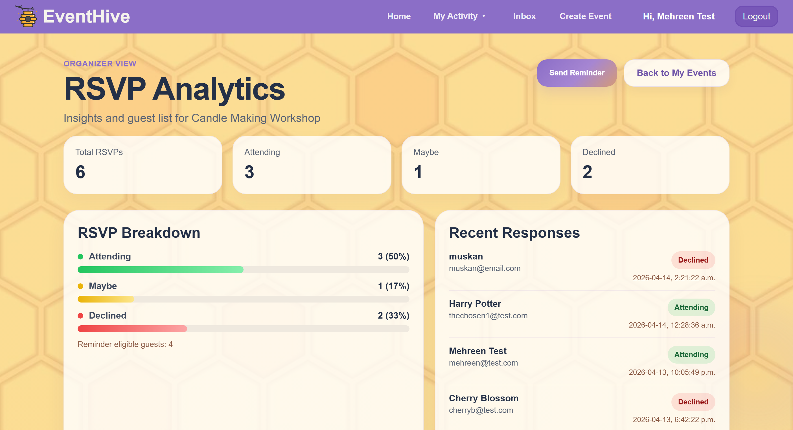

#  EventHive

> A full-stack event management platform where attendees discover, connect, and engage — while organizers track, analyze, and grow their events.

[](https://nodejs.org)
[](https://vuejs.org)
[](https://mongodb.com)

##### Click here to watch the demo:
[](https://youtube.com)
---

## Table of Contents

- [Features](#features)
- [Tech Stack](#tech-stack)
- [Installation](#installation)
- [Running the App](#running-the-app)
- [User Roles](#user-roles)
- [Database Schema](#database-schema)
- [Project Structure](#project-structure)
- [Future Roadmap](#future-roadmap)
- [Contributors](#contributors)

---

## Features

| Category | Features |
|----------|----------|
|**Events** | Create, edit, delete, save |
|**Search** | Filter by title, category, date (year, month, day), or location |
|**RSVP** | Attending / Maybe / Declined with organizer tracking |
|**Matchmaking** | Connect with like-minded attendees, send/accept requests, chat messaging|
|**Analytics** | D3.js bar charts & pie charts for RSVPs and poll results |
|**Polls** | Organizers create polls; attendees vote; live results visualization |
|**Suggestions** | Community-driven event ideas with upvotes |
|**Inbox** | Event reminders, matchmaking requests, chat messages, read/unread status |

---

## Tech Stack

<div align="center">

| Layer | Technologies |
|-------|---------------|
| **Frontend** | Vue • JavaScript • HTML • CSS • jQuery • DOM • D3.js • SVG|
| **Backend** | Node.js • Express.js • AJAX • REST API |
| **Database** | MongoDB Atlas |
| **Tooling** | Concurrently • Fetch API |

</div>

---

## Installation

### Prerequisites

- [Node.js](https://nodejs.org/)
- [npm](https://www.npmjs.com/)

### Steps

### 1. Clone the repository
```
git clone https://github.com/m3hreen/webdev-final.git
```

### 2. Install frontend dependencies
```
cd eventhive
npm install
npm install jquery vue-router d3
npm install d3
```

### 3. Install backend dependencies
```
cd backend
npm install
```

### 4. Install concurrently (to run both servers at once)
```
cd ../..
npm install concurrently --save-dev
```

> **Note:** You may have to create a `.env` file in the `backend/` folder with your MongoDB Atlas connection string. Our MongoDB access is public, so you are not expected to do this if there aren't any errors.

---

## Running the App

```bash
npm run dev:all
```

| Server | URL |
|--------|-----|
|Frontend (Vite) | `http://localhost:5173` |
|Backend (Express) | `http://localhost:5001` |

> **The backend MUST be running** for: login/signup, RSVP, polls, inbox/chat, matchmaking, and reminders. It should already be running since the command should run all concurrently.


## Need Help Setting Up?


| **Video Tutorial** |
|:---------------------:|
| [](https://youtu.be/E0MzKak7egc) |

---

## User Roles

<table>
<tr>
<th>Everyone</th>
<th>Attendees</th>
<th>Organizers</th>
</tr>
<tr>
<td>

- Browse/filter events
- View event details
- RSVP
- Save events
- Vote on polls
- Matchmaking: Connect with attendees
- Use inbox & messaging
- View/like community suggestions

</td>
<td>

- Submit event suggestions
- Access MySuggestions page
- View upcoming events and recent activity on dashboard

</td>
<td>

- Create/edit/delete events
- View MyEvents page
- Create polls
- Access guest lists
- View analytics (D3 charts)
- Send reminders
- View top event requests on dashboard

</td>
</tr>
</table>

---

## Database Schema

**MongoDB Collections:**

```
Users
Events
RSVPs
Polls
Suggestions
SavedEvents
MatchmakingRequests
Messages
Reminders
```

---

## Project Structure

```
eventhive/
│
├── public/                    # SVG icons
│   
├── screenshots/               # screenshots for readme.md
│   
├── src/                    # Frontend (Vue 3)
│   ├── pages/                 # Page components
│   ├── components/            # Reusable Vue components
│   ├── router/                # Vue Router config
│   └── assets/                # CSS, images, SVG logo
│
├── backend/                # Backend (Node.js + Express)
│   ├── routes/                # API endpoints
│   ├── db/                    # MongoDB connection
│   └── server.js              # Entry point
│
└── package.json            # Root package file
```

---

## Future Roadmap

- Real-time messaging with **Socket.io**
- Image uploads (instead of URLs) via Cloudinary
- Push & email notifications
- AI-powered event recommendations
- Google Calendar / iCal integration
- Mobile-responsive PWA

---

## Screenshots

<div align="center">

<table>
  <tr>
    <td align="center">
      <br/>
      <sub><b>Burger Menu</b></sub>
    </td>
    <td align="center">
      <br/>
      <sub><b>Featured Events</b></sub>
    </td>
    <td align="center">
      <br/>
      <sub><b>Landing Page</b></sub>
    </td>
  </tr>
  <tr>
    <td align="center">
      <br/>
      <sub><b>Login Page</b></sub>
    </td>
    <td align="center">
      <br/>
      <sub><b>Poll Results</b></sub>
    </td>
    <td align="center">
      <br/>
      <sub><b>RSVP Analytics</b></sub>
    </td>
  </tr>
</table>

</div>

---

## Contributors

- Malasa Khan
- Mehreen Morshed
- Muskan Morshed
- Shimza Warraich

---

<div align="center">
  <sub>Built by Team EventHive 🐝 </sub>
</div>
